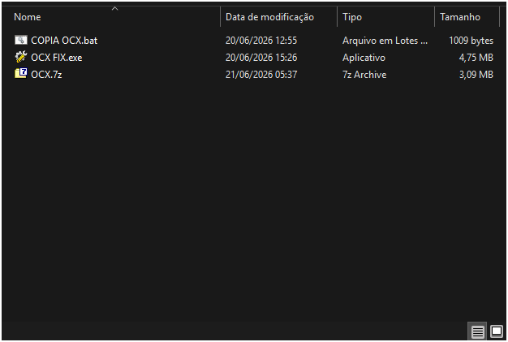
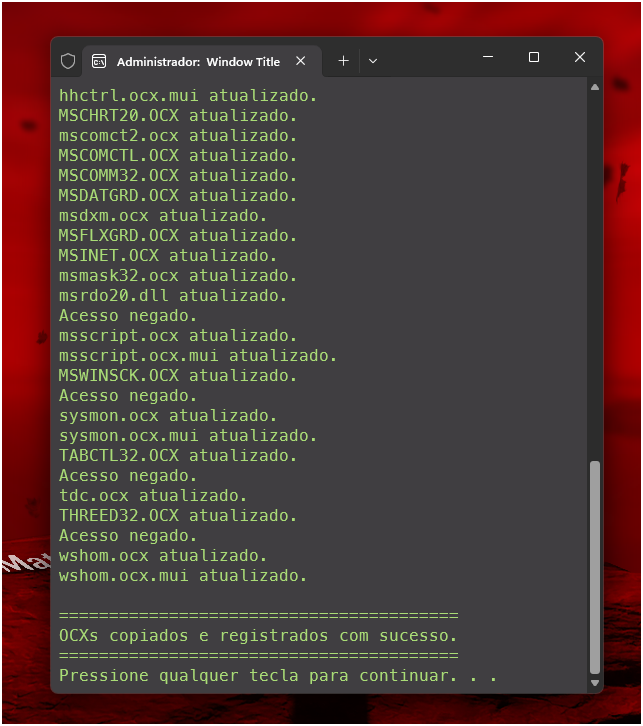

<div align="center">


# OCX FIX

**Utilitário para instalação e registro automático de bibliotecas OCX no Windows**


</div>

---

## 📖 Descrição

O **OCX FIX** é um utilitário desenvolvido em **Batch Script (.bat)** para automatizar a correção de problemas relacionados a bibliotecas **OCX (ActiveX)** em sistemas Windows.

A ferramenta realiza automaticamente a cópia dos arquivos `.ocx` para os diretórios corretos do sistema e executa o registro utilizando o comando `regsvr32`, eliminando a necessidade de procedimentos manuais por parte do usuário.

Além disso, possui um mecanismo inteligente de elevação de privilégios que detecta quando o script não está sendo executado como Administrador e solicita automaticamente a autorização via **UAC (User Account Control)**.

---

## ✨ Funcionalidades

* ✅ Cópia automática de arquivos `.ocx`
* ✅ Registro automático utilizando `regsvr32`
* ✅ Detecção automática de privilégios administrativos
* ✅ Solicitação automática de elevação via UAC
* ✅ Compatível com sistemas 32 e 64 bits
* ✅ Processo simplificado para equipes de suporte
* ✅ Execução totalmente automatizada
* ✅ Não requer instalação

---

## 📋 Pré-requisitos

Antes de utilizar o OCX FIX, certifique-se de possuir:

* Windows XP
* Windows 7
* Windows 8 / 8.1
* Windows 10
* Windows 11

> É necessário possuir permissões administrativas para registrar componentes OCX no sistema.

---

## 🚀 Como Usar

### 1. Baixe o projeto

```bash
git clone https://github.com/sandrolsa/OCX-FIX.git
```

Ou faça o download da versão mais recente na página de Releases.

---

### 2. Execute o arquivo

Utilize o OCX FIX.exe 

```text
OCX_FIX.exe
```

Ou extraia o OCX.zip e execute o arquivo OCX.bat manualmente:

```text
🗒️OCX.bat
📁OCX
```

e execute normalmente.
Caso o script não esteja sendo executado como Administrador, o próprio sistema solicitará automaticamente a autorização através do UAC.

---

### 3. Aguarde a conclusão

O processo executará automaticamente:

```bat
:: Cópia dos arquivos OCX
copy *.ocx %SystemRoot%\System32\

:: Registro das bibliotecas
regsvr32 /s biblioteca.ocx
```

Ao final, os componentes estarão devidamente registrados no sistema.

---

## 🖼️ Screenshots

### Tela Principal



### Processo de Registro



---

## 🛠️ Estrutura do Projeto

```text
OCX-FIX/
│
├── OCX_FIX.bat
├── ocx/
│   ├── arquivo1.ocx
│   ├── arquivo2.ocx
│   └── ...
│
├── assets/
│   ├── ocx_fix_48x48.png
│   └── screenshot.png
│
└── README.md
```

---

## 👨‍💻 Autor

Desenvolvido por **Sandro Luiz Silva Aguiar**

GitHub:

https://github.com/sandrolsa

---

## 📄 Licença

Este projeto está licenciado sob os termos da licença **MIT**.

Consulte o arquivo `LICENSE` para mais informações.

---

<div align="center">

Feito com ❤️ para simplificar o suporte e a instalação de componentes ActiveX no Windows.

</div>
